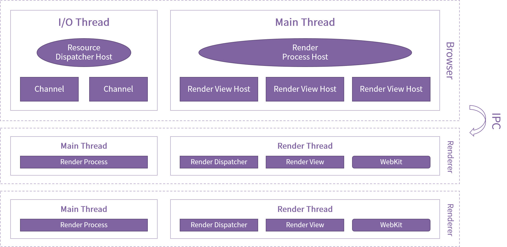
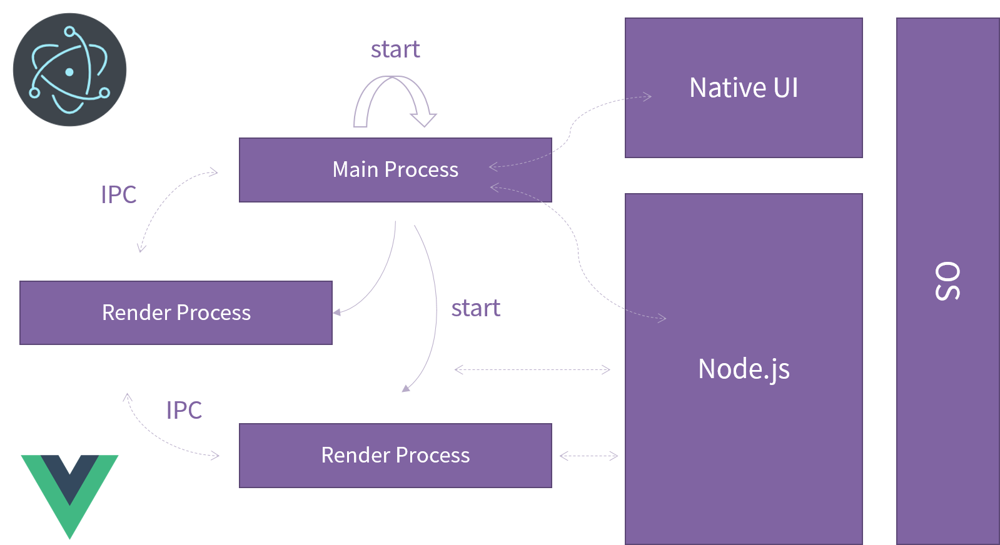

  

# veeui-plugin-axure

> A Plugin of Axure for Vee UI Library

## Principle

The overall architecture design adopts a multi-process approach, which can be divided into two main parts: the `main process` and the `render process`. It uses a desktop-based architecture built on web technology.

[VeeUI Axure Plugin](https://github.com/vleedesigntheory/veeui-plugin-axure) adopts the technical implementation idea based on [Electron](https://www.electronjs.org/).

## License

[MIT](http://opensource.org/licenses/MIT)

Copyright (c) 2023-present VLeeDesignTheory
